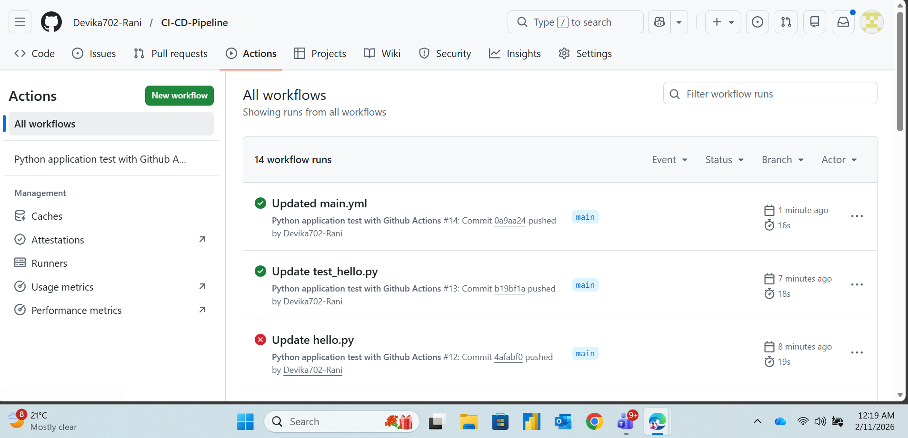
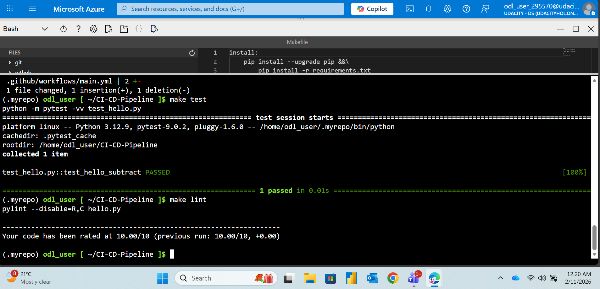
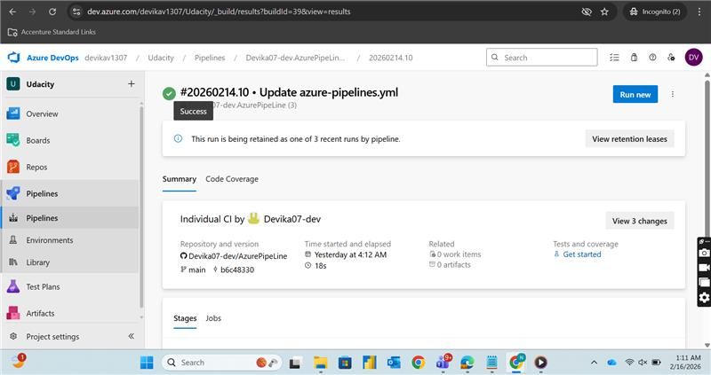
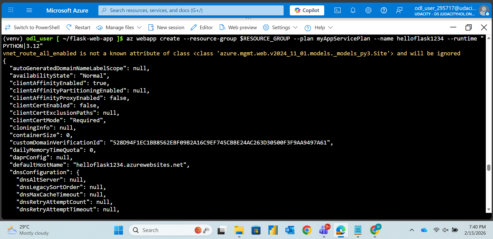

# Building a CI/CD Pipeline with GitHub Actions and Azure.


 
This project demonstrates a full CI/CD pipeline using GitHub Actions and Azure.

## Project Overview
In this project, a complete CI/CD pipeline is built using GitHub and Microsoft Azure.  
The project demonstrates core DevOps principles by implementing Continuous Integration (CI) using GitHub Actions and Continuous Delivery (CD) using Azure Pipelines and Azure App Service.
 
The repository contains a Python-based machine learning application built with Flask. The CI pipeline performs linting, testing, and dependency installation, while the CD pipeline deploys the application to Azure App Service.

 ## Architecture Diagram
 
The following diagram illustrates the overall architecture and workflow of the project, including source control, CI/CD pipelines, and deployment to Azure App Service.
 

 
**Architecture Flow:**
- Source code is managed in GitHub
- GitHub Actions performs Continuous Integration (linting and testing)
- Azure Pipelines enables Continuous Delivery
- The application is deployed to Azure App Service (PaaS)
- A Flask-based Machine Learning API serves predictions
 
---

## Instructions for Running the Python Project
 
### Prerequisites
Ensure the following tools are installed on your system:
 
- Python 3.8 or higher
- Git
- Make
- Azure CLI (for deployment-related steps)
- An active Azure subscription

### Step 1: Clone the Repository
```bash
git clone https://github.com/<your-username>/<your-repository-name>.git
cd <your-repository-name>
```

### Step 2: Create and Activate a Virtual Environment

Create a Python virtual environment to isolate project dependencies.
 
```bash
python -m venv venv
source venv/bin/activate   # Linux / Mac
venv\Scripts\activate      # Windows
```

### Step 3: Install Dependencies

Install all required Python packages needed to run the application.
 
```bash
make install
```

### Step 4: Run Lint Checks
Run linting to analyze the Python code for style issues and best practices.
 
```bash
make lint
```

### Step 5: Run Unit Tests
Run automated unit tests to ensure the application functions correctly.
 
```bash
make test
```

## Screenshots Demonstrating Key Steps
 
### 1. Successful Linting and Testing in Azure Cloud Shell
This screenshot shows the project running in Azure Cloud Shell with successful execution of both lint checks and unit tests using the Makefile.
 

 
---
 
### 2. Successful Continuous Integration Using GitHub Actions
This screenshot demonstrates a successful GitHub Actions pipeline run, confirming that Continuous Integration is working correctly with automated linting and testing.
 

 
---
 
### 3. Successful Deployment Using Azure Pipelines
This screenshot shows a successful Azure Pipeline execution, confirming Continuous Delivery and deployment of the application to Azure services.
 


## 4.Azure Pipeline – Successful Run
 
The CI/CD pipeline successfully builds and deploys the application.
 

 
This screenshot shows:
- Pipeline run with green checkmark
- Successful build stage
- Successful deploy stage
 
---
 
## 5.Successful Creation of Azure Webapp
 
The Successful Creation of Azure webapp Azure Cloud Shell.



---
## 6.Screenshot of Project deployed in Azure


---

## 7.Screenshot of Successful machine learning prediction 


---

## 8.Screenshot of successful run of the project in Azure Pipelines


---
## Project Management
 
### Trello Board
The project workflow and key tasks are tracked using a Trello board with a simple agile flow: *To Do, **In Progress, **Done*.  
- Key Task Cards include: Repository Setup, Python Application, Makefile, Lint & Tests, GitHub Actions CI, Azure Pipeline CD, Deployment, README, and Screencast.  
 
View the Trello board here: [CI/CD Pipeline Project Board](https://trello.com/invite/b/698d0e8e45f68ef987de118f/ATTI73e5ed1d01ed75d82530e4bb762a0c5d0E0B786C/my-trello-board)

### Spreadsheet / Project Plan
 
A project plan spreadsheet is included to show planning and tracking of milestones, deliverables, and task estimations.
 
*Contents of the Spreadsheet:*
- A quarterly and yearly plan
- Estimates of the week by week deliverables
- Estimation of difficulty or time (or both) for each task
- Task Estimation: Difficulty or time estimation for each task
 
You can access the spreadsheet here: [Project Plan Spreadsheet](./project-plan.xlsx)

### Project Screencast
 
Watch the full demo here: [CI/CD Pipeline Demo](https://youtu.be/-ISpr9sDzOg)

## Future Improvements
 
While the current CI/CD pipeline and application are functional, there are several areas for future enhancement:
 
1. *Automated Testing Expansion:* Add more comprehensive unit and integration tests to cover edge cases and ensure higher test coverage.
2. *Containerization:* Package the application using Docker for more consistent deployments across different environments.
3. *Advanced CI/CD Features:* Implement automated rollback, notifications on pipeline failure, and multi-environment deployments (staging, production).
4. *Machine Learning Enhancements:* Integrate additional preprocessing, model versioning, and logging for improved ML predictions.
5. *Improved Documentation:* Include detailed setup scripts, troubleshooting steps, and code comments for easier onboarding of future contributors.
